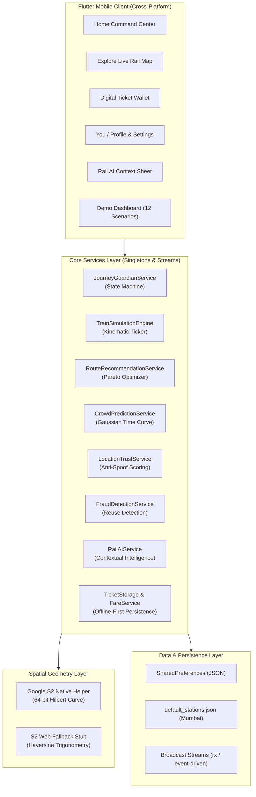
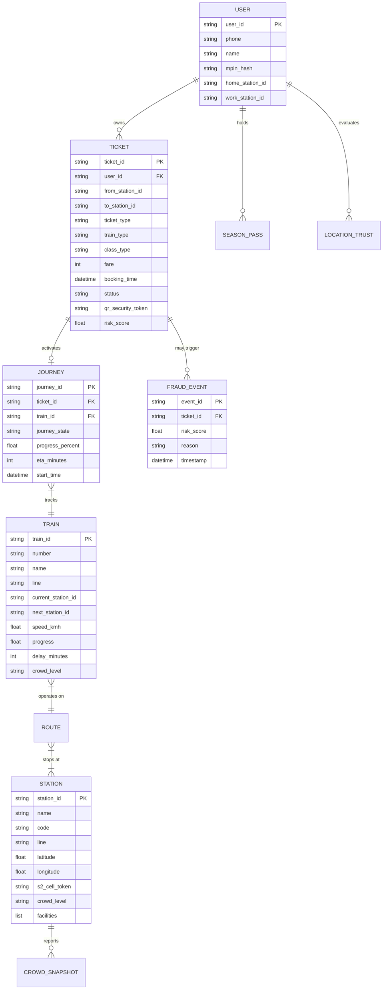
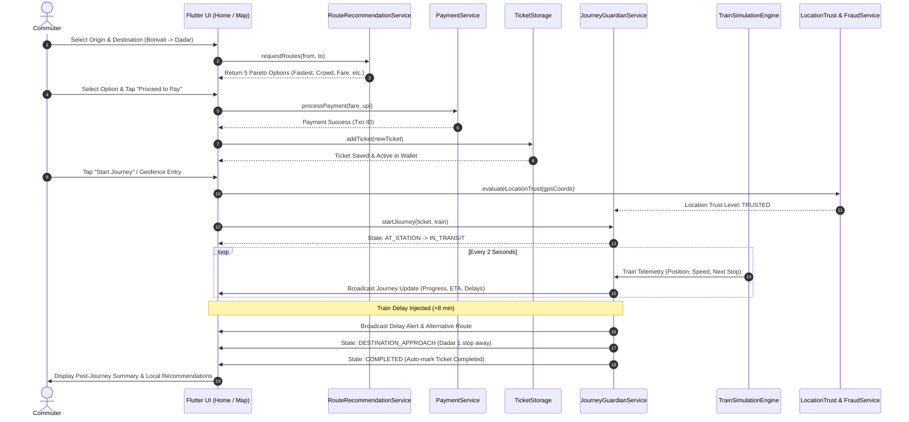

# 🚆 LOCO — AI-Powered Intelligent Urban Rail Mobility Platform (Mumbai)

> **A production-grade, state-of-the-art urban railway mobility platform for the Mumbai Suburban Network.**  
> LOCO combines **Google S2 Spatial Geometry**, **deterministic live train telemetry simulation**, **Journey Guardian real-time state machine**, **multi-objective AI route intelligence**, **dynamic cryptographic digital ticketing**, **anti-spoofing / fraud detection**, and **contextual post-journey urban discovery** — built on a clean **Orange (`#FF5500`) + White** design system.

---

## 📑 Table of Contents

1. [Executive Summary & Brand Identity](#1-executive-summary--brand-identity)
2. [End-to-End User Journey Flow](#2-end-to-end-user-journey-flow)
3. [Software & Systems Architecture](#3-software--systems-architecture)
4. [Algorithms, Data Science & ML Models](#4-algorithms-data-science--ml-models)
5. [Core Database Entities & ER Model](#5-core-database-entities--er-model)
6. [Runtime Data Flow](#6-runtime-data-flow)
7. [Subsystem Breakdown & Features](#7-subsystem-breakdown--features)
   - [7.1 Visual Identity & Design System](#71-visual-identity--design-system)
   - [7.2 Home Command Center & Adaptive Hero](#72-home-command-center--adaptive-hero)
   - [7.3 Live Rail Network & Simulation Engine](#73-live-rail-network--simulation-engine)
   - [7.4 AI Journey Planner & Multi-Objective Routing](#74-ai-journey-planner--multi-objective-routing)
   - [7.5 Journey Guardian™ Active Monitoring](#75-journey-guardian-active-monitoring)
   - [7.6 Dynamic Ticket Wallet & Secure QR](#76-dynamic-ticket-wallet--secure-qr)
   - [7.7 Security, Anti-Spoofing & Fraud Detection](#77-security-anti-spoofing--fraud-detection)
   - [7.8 Ticketless Travel Intervention](#78-ticketless-travel-intervention)
   - [7.9 Delay Intelligence & Real-time Alternative Routing](#79-delay-intelligence--real-time-alternative-routing)
   - [7.10 Contextual Rail AI Assistant](#710-contextual-rail-ai-assistant)
   - [7.11 Post-Journey Urban Discovery](#711-post-journey-urban-discovery)
   - [7.12 Season Pass System](#712-season-pass-system)
8. [Interactive Developer & Demo Dashboard (12 Scenarios)](#8-interactive-developer--demo-dashboard-12-scenarios)
9. [Project Directory & File Structure](#9-project-directory--file-structure)
10. [Setup, Execution & Verification](#10-setup-execution--verification)
11. [Authors & License](#11-authors--license)

---

## 1. Executive Summary & Brand Identity

In high-density transit ecosystems like the Mumbai Suburban Railway (carrying over 7.5 million daily commuters across Western, Central, and Harbour lines), passengers face immense friction: crowded booking counters, opaque delays, confusing interchange transfers, and lack of real-time spatial context.

**LOCO** transforms urban commuting from a stressful chore into an effortless, intelligent journey.

### 🎨 Visual & Brand Direction
- **Primary Brand Colors**:
  - **LOCO Orange (`#FF5500`)**: High-energy CTA buttons, active route highlights, journey progress, and alerts.
  - **White (`#FFFFFF`)**: Dominant canvas, providing an ultra-clean, modern, distraction-free environment.
  - **Warm Light Neutral (`#F8F9FA` / `#F3F4F6`)**: Background surface contrast.
  - **Deep Charcoal (`#111827`)**: High-contrast, legible typography.
- **Design Philosophy**: *"Simple on the surface. Powerful underneath."* Normal users never feel overwhelmed by technology; complex spatial math, fraud scoring, and train kinematics operate silently beneath a fluid, intuitive interface.

---

## 2. End-to-End User Journey Flow

```mermaid
flowchart LR
    A["1. Open LOCO\n• Splash & Auth\n• GPS S2 geofence"] --> B["2. Plan Journey\n• Origin + Dest\n• AI Route Engine\n• Time / Crowd / Fare"]
    B --> C["3. Book Ticket\n• Fare Engine\n• Mock UPI / Cards\n• Ticket Generation"]
    C --> D["4. Dynamic Ticket\n• Secure QR Token\n• Stored in Wallet\n• Lifecycle: Active"]
    D --> E["5. Start Journey\n• Geofence entry\n• Location Trust\n• Guardian activates"]
    E --> F["6. Live Tracking\n• Moving Trains\n• Real-time ETA\n• Crowd Intelligence"]
    F --> G["7. Delay Handling\n• Real-time delay alert\n• Alternative route\n• Rail AI assistance"]
    G --> H["8. Destination\n• Arrival alert\n• Ticket Completed\n• Post-journey spots"]
```



1. **Open App**: Minimal splash with LOCO wordmark $\rightarrow$ OTP authentication $\rightarrow$ background GPS location acquisition.
2. **Plan Journey**: User inputs `Borivali` $\rightarrow$ `Dadar`. The AI Route Planner presents 5 optimized routes (Fastest, Least Crowded, Cheapest, Fewest Transfers, AC Comfort).
3. **Book Ticket**: Selects route, chooses train/class tier, completes instant mock payment.
4. **Dynamic Ticket**: Generates a high-contrast digital ticket with HMAC-style QR security payload stored offline in `SharedPreferences`.
5. **Start Journey**: Approaching the station triggers geofencing and evaluates `LocationTrustService`. Journey Guardian begins live journey monitoring.
6. **Live Tracking**: Vector-rendered rail map renders real-time moving trains, station nodes, and route progress.
7. **Delay Handling**: If a delay occurs, LOCO proactively alerts the commuter and computes an alternative route saving travel time.
8. **Destination**: When approaching destination, LOCO sends arrival notifications, transitions ticket to `COMPLETED`, presents journey stats, and curates local food, cafes, and sights.

---

## 3. Software & Systems Architecture



### Architectural Layering
- **Presentation Layer**: Pure declarative Flutter widgets with clean separation between stateful controllers and stateless views.
- **Service Layer**: Event-driven Dart services broadcasting changes via `StreamController.broadcast()`. Any screen (Home, Map, Tickets, Guardian) can listen and update reactively without tight coupling.
- **Domain Layer**: Immutable data models with explicit serialization, lifecycle states, and validation logic.
- **Platform Abstraction**: Native C/C++ Google S2 geometry on mobile desktop platforms with automated fallback to trigonometric spherical math on Web.

---

## 4. Algorithms, Data Science & ML Models

| Domain | Algorithm / Model | Description | Implementation File |
| :--- | :--- | :--- | :--- |
| **Spatial Proximity** | **Google S2 Hilbert Space-Filling Curve (Level 13)** | Maps 2D spherical coordinates $(\text{lat}, \text{lng})$ into a 1D 64-bit integer cell token. Guarantees sub-millisecond station radius queries. | [`lib/services/s2_service.dart`](file:///lib/services/s2_service.dart) |
| **Route Optimization** | **Multi-Objective Pareto Engine** | Evaluates transit graphs across multiple cost functions: Travel Time ($T$), Financial Fare ($F$), Crowd Density ($C$), and Transfers ($K$):$$\text{Score} = w_1 T + w_2 F + w_3 C + w_4 K$$ | [`lib/services/route_recommendation_service.dart`](file:///lib/services/route_recommendation_service.dart) |
| **Crowd Prediction** | **Gaussian Rush-Hour Probability Density** | Simulates commuter density as a mixture of Gaussians centered at peak commuting hours (08:30–10:30 & 17:30–20:00) conditioned on station importance:$$P(\text{crowd}) = \sum_{k} A_k \exp\left(-\frac{(t - \mu_k)^2}{2\sigma_k^2}\right)$$ | [`lib/services/crowd_prediction_service.dart`](file:///lib/services/crowd_prediction_service.dart) |
| **Anti-GPS Spoofing** | **Kinematic Trajectory Consistency Filter** | Measures velocity differentials between successive GPS readings:$$v = \frac{\Delta d}{\Delta t}$$Flags anomaly if $v > 120\text{ km/h}$, mock location provider is detected, or accuracy variance exceeds threshold. | [`lib/services/security_services.dart`](file:///lib/services/security_services.dart) |
| **Fraud Detection** | **Spatiotemporal Ticket Reuse Model** | Maintains a rolling log of QR validation timestamps. If ticket ID $T$ is validated at Station $S_1$ at $t_1$ and subsequently scanned at $S_2$ at $t_2$ where $\frac{\text{dist}(S_1, S_2)}{t_2 - t_1} > v_{\max}$, an anomaly event is raised. | [`lib/services/security_services.dart`](file:///lib/services/security_services.dart) |
| **Train Kinematics** | **Deterministic Ticker Simulation** | Interpolates train position along piecewise linear segments between stations at realistic suburban speeds ($45\text{--}80\text{ km/h}$) with automated station dwell times. | [`lib/simulation/train_simulation_engine.dart`](file:///lib/simulation/train_simulation_engine.dart) |

---

## 5. Core Database Entities & ER Model



---

## 6. Runtime Data Flow



---

## 7. Subsystem Breakdown & Features

### 7.1 Visual Identity & Design System
- All design tokens are strictly centralized in [`lib/core/theme/loco_theme.dart`](file:///lib/core/theme/loco_theme.dart).
- High-contrast visual tokens ensure instant legibility under harsh Indian daylight on suburban railway platforms.
- Interactive states use subtle micro-animations (pills, pulsing indicators, smooth route progress bars).

### 7.2 Home Command Center & Adaptive Hero
- **Adaptive Context**: If no journey is active, the hero displays *"Where are you going?"* with rapid station search, recent routes, and quick action cards.
- **Active Journey Mode**: When a ticket is active, the home screen transforms into the **Journey Guardian Command Card**, presenting live train speed, next stop, progress bar, platform number, and dynamic ETA.
- **Quick Action Grid**: One-tap access to *Live Rail Map*, *Ticket Wallet*, *Season Passes*, and the *Interactive Demo Dashboard*.

### 7.3 Live Rail Network & Simulation Engine
- Interactive vector map rendered via Flutter custom painter ([`lib/widgets/live_rail_map.dart`](file:///lib/widgets/live_rail_map.dart)).
- Renders Western Line (Orange), Central Line (Teal/Blue), and Harbour Line (Green).
- Displays animated trains moving along tracks in real-time with pulse indicators and directional tracking.
- Commuters can tap any station or train to view full telemetry sheets.

### 7.4 AI Journey Planner & Multi-Objective Routing
- Replaces traditional single-route search with an intelligent multi-objective recommendation engine.
- Calculates and presents:
  1. **Fastest Route** (Local fast services skipping minor halts)
  2. **Least Crowded Route** (Calculated via Gaussian occupancy models)
  3. **Cheapest Route** (Optimized for second class standard transit)
  4. **Fewest Transfers** (Direct suburban lines)
  5. **AC Comfort Route** (Air-conditioned suburban rake availability)

### 7.5 Journey Guardian™ Active Monitoring
- Finite state machine managing the complete commute:
  `PLANNED` $\rightarrow$ `AT_STATION` $\rightarrow$ `BOARDED` $\rightarrow$ `IN_TRANSIT` $\rightarrow$ `DESTINATION_APPROACH` $\rightarrow$ `COMPLETED`.
- Continuously monitors station proximity, speed plausibility, and route adherence.
- Reassures commuters with gentle progress feedback without spamming notifications.

### 7.6 Dynamic Ticket Wallet & Secure QR
- Dynamic digital ticket cards ([`lib/widgets/dynamic_ticket_card.dart`](file:///lib/widgets/dynamic_ticket_card.dart)) displaying booking references (e.g. `XODHEGL014`), class, validity countdown, and status tags.
- Tapping "Show QR" opens the **Digital Ticket Inspector** ([`lib/widgets/digital_ticket_inspector.dart`](file:///lib/widgets/digital_ticket_inspector.dart)) featuring:
  - Cryptographic QR containing signed token payload: `LOCO|TICKET_ID|EXPIRY|HMAC_SIG`.
  - TTE Verification simulation button to test instant field validation.

### 7.7 Security, Anti-Spoofing & Fraud Detection
- **Anti-GPS Spoofing**: Continuously evaluates device mock location flags, impossible velocity jumps ($>120\text{ km/h}$), and location accuracy variance.
- **Fraud Risk Scoring**: Detects spatiotemporal ticket reuse across distant stations within impossible transit windows, assigning transparent risk scores (`LOW`, `ELEVATED`, `HIGH`).

### 7.8 Ticketless Travel Intervention
- Rather than solely acting as an enforcement mechanism, if a commuter enters a railway geofence without an active ticket, LOCO displays a friendly, non-accusatory intervention:
  *"No active ticket detected at Dadar Station. Book a ticket in 2 taps."*
- Turns enforcement into frictionless compliance.

### 7.9 Delay Intelligence & Real-Time Alternative Routing
- If a train experiences a delay ($>5\text{ min}$), LOCO warns the commuter and automatically calculates alternative connecting routes that save time.

### 7.10 Contextual Rail AI Assistant
- Slide-up bottom sheet assistant ([`lib/widgets/rail_ai_sheet.dart`](file:///lib/widgets/rail_ai_sheet.dart)) trained on Mumbai suburban railway domain context.
- Answers queries such as:
  - *"Which train should I take to Dadar?"*
  - *"Is my train delayed?"*
  - *"Find me the least crowded option."*
  - *"Where should I change trains?"*
  - *"Where can I eat near Dadar?"*

### 7.11 Post-Journey Urban Discovery
- When the commuter arrives at their destination, Journey Guardian completes the journey and presents curated local recommendations ([`lib/widgets/post_journey_sheet.dart`](file:///lib/widgets/post_journey_sheet.dart)) for dining, cafes, shopping, and landmarks.

### 7.12 Season Pass System
- Comprehensive season pass booking engine ([`lib/screens/season_booking_screen.dart`](file:///lib/screens/season_booking_screen.dart)) supporting:
  - Monthly, Quarterly, Half-Yearly, and Yearly durations.
  - Self vs Other passenger delegation.
  - KYC details (Masked PAN/Aadhaar number, address, and live photo attachment).

---

## 8. Interactive Developer & Demo Dashboard (12 Scenarios)

LOCO includes a built-in, developer-accessible **Demo Dashboard** ([`lib/screens/demo_dashboard_screen.dart`](file:///lib/screens/demo_dashboard_screen.dart)) accessible via the top-right tool icon on the Home screen or from the "You" tab.

This dashboard allows testing and verifying all 12 end-to-end product scenarios without requiring physical field movement:

| # | Scenario | Triggered System Action |
| :---: | :--- | :--- |
| **1** | **Normal Journey** | Initializes a healthy Borivali $\rightarrow$ Dadar journey with on-time train and normal crowd. |
| **2** | **Train Approaching** | Advances train position to 2 minutes from station, triggering boarding alert. |
| **3** | **Train Delayed (+8 min)** | Injects an 8-minute signal delay, triggering the delay notification. |
| **4** | **High Crowd Alert** | Updates coach occupancy to HIGH (88%), triggering crowd warning. |
| **5** | **Alternative Route Suggested** | Generates an alternative fast train option saving 6 minutes. |
| **6** | **Simulate GPS Spoofing** | Injects an impossible coordinate jump, transitioning Location Trust to SUSPICIOUS. |
| **7** | **Ticket Reuse Anomaly** | Simulates multi-station validation, flagging fraud risk to ELEVATED. |
| **8** | **No Ticket at Station** | Clears active tickets while at station geofence, triggering friendly compliance prompt. |
| **9** | **Journey Started (Boarded)** | Sets Journey Guardian state to `BOARDED` with real-time speed monitoring. |
| **10** | **Destination Approaching** | Triggers "Dadar is next stop" alert with platform details. |
| **11** | **Journey Completed** | Transitions ticket to `COMPLETED`, opens journey summary and local spot discovery. |
| **12** | **Reset All State** | Restores clean state for fresh demonstration. |

---

## 9. Project Directory & File Structure

```text
Rail-Two/
├── assets/
│   └── default_stations.json          # Seeded Mumbai stations (Western, Central, Harbour)
├── lib/
│   ├── core/
│   │   ├── constants/
│   │   │   └── loco_branding.dart     # Brand wordmark, typography & app metadata
│   │   └── theme/
│   │       └── loco_theme.dart        # LOCO Orange + White Design System tokens
│   ├── models/
│   │   ├── ai_models.dart             # Rail AI messages & destination spots
│   │   ├── journey.dart               # ActiveJourney & JourneyState state machine
│   │   ├── route_option.dart          # Multi-objective route models
│   │   ├── security_models.dart       # Location trust & fraud detection entities
│   │   ├── station.dart               # RailwayStation with S2 tokens & facilities
│   │   ├── ticket.dart                # BookedTicket with lifecycle & QR security token
│   │   └── train.dart                 # LocoTrain kinematic telemetry model
│   ├── screens/
│   │   ├── add_station_screen.dart    # Custom station creation with S2 preview
│   │   ├── booking_screen.dart        # Journey ticket booking with LOCO payment
│   │   ├── demo_dashboard_screen.dart # 12-scenario interactive test bench
│   │   ├── explore_screen.dart        # Fullscreen live railway network map
│   │   ├── home_screen.dart           # Primary command center & adaptive hero
│   │   ├── login_screen.dart          # Phone & OTP authentication
│   │   ├── main_navigation_shell.dart # 4-tab bottom navigation + Rail AI floating trigger
│   │   ├── onboarding_screen.dart     # 4-slide LOCO introduction experience
│   │   ├── otp_verification_screen.dart
│   │   ├── route_planner_screen.dart  # Multi-objective route comparison screen
│   │   ├── season_booking_screen.dart # Monthly/Quarterly season pass issuer
│   │   ├── set_mpin_screen.dart       # 4-digit biometric unlock setup
│   │   ├── splash_screen.dart         # Minimal LOCO orange movement animation
│   │   ├── stations_list_screen.dart  # Mumbai stations & S2 nodes directory
│   │   ├── tickets_screen.dart        # Digital ticket wallet (Active, History, Passes)
│   │   └── you_screen.dart            # User profile, security status & preferences
│   ├── services/
│   │   ├── crowd_prediction_service.dart   # Gaussian rush-hour crowd forecaster
│   │   ├── journey_guardian_service.dart   # Core active journey monitoring engine
│   │   ├── payment_service.dart            # Mock UPI / Cards payment gateway
│   │   ├── rail_ai_service.dart            # Contextual railway LLM assistant
│   │   ├── route_recommendation_service.dart # Pareto multi-objective route optimizer
│   │   ├── s2_helper_native.dart           # C/C++ Google S2 native implementation
│   │   ├── s2_helper_web.dart              # Trigonometric spherical fallback
│   │   ├── s2_service.dart                 # S2 spatial facade
│   │   ├── security_services.dart          # LocationTrustService & FraudDetectionService
│   │   ├── station_service.dart            # Station database repository
│   │   └── ticket_storage.dart             # SharedPreferences offline ticket store
│   ├── simulation/
│   │   └── train_simulation_engine.dart    # Deterministic live train simulation
│   ├── widgets/
│   │   ├── digital_ticket_inspector.dart   # High-contrast TTE verification pass
│   │   ├── dynamic_ticket_card.dart        # Digital wallet ticket card with QR trigger
│   │   ├── live_rail_map.dart              # Interactive vector canvas railway map
│   │   ├── post_journey_sheet.dart         # Arrival summary & local discovery
│   │   ├── rail_ai_sheet.dart              # Conversational Rail AI bottom sheet
│   │   ├── station_details_sheet.dart      # Station amenities & route selector
│   │   └── train_details_sheet.dart        # Live train telemetry inspector
│   └── main.dart                           # App root configuring LocoTheme
├── test/
│   └── widget_test.dart               # Widget & sanity verification tests
└── pubspec.yaml                       # Dependencies & asset declarations
```

---

## 10. Setup, Execution & Verification

### Prerequisites
- **Flutter SDK**: `>=3.0.0 <4.0.0`
- **Dart SDK**: `>=3.0.0 <4.0.0`
- Target: Android, iOS, or Chrome (Web)

### Installation & Run Commands
```bash
# 1. Clone repository and navigate to workspace
cd Rail-Two

# 2. Install dependencies
flutter pub get

# 3. Analyze codebase for zero errors
dart analyze lib

# 4. Run tests
flutter test

# 5. Launch LOCO in Debug mode
flutter run -d chrome
# Or for mobile:
flutter run -d android
```

### Verifying the Complete Story
1. Open the application and view the **LOCO Splash Screen** followed by the **Onboarding Tour**.
2. Sign in with mobile number and verify OTP.
3. On the **Home Command Center**, select **Borivali** $\rightarrow$ **Dadar**.
4. Compare route cards (Fastest: 34 min vs Least Crowded: 41 min).
5. Select a route and tap **Book Ticket** $\rightarrow$ complete mock UPI payment.
6. The digital ticket appears in the **Ticket Wallet**.
7. Tap **Start Journey** to activate **Journey Guardian**.
8. Open the **Explore** tab to watch your train move smoothly along the live railway network.
9. Open the **Demo Dashboard** (top right tool icon on Home) and test scenarios (Train Delayed, High Crowd, GPS Spoofing, Ticket Reuse).
10. Trigger **Destination Approaching** $\rightarrow$ **Journey Completed** to inspect the **Post-Journey Urban Discovery** sheet.

---

## 11. Authors & License

- **Product Engineering & Architecture**: LOCO Engineering Team
- **Spatial Geometry**: Google S2 Spatial Framework
- **License**: MIT License — open for academic and production research.
