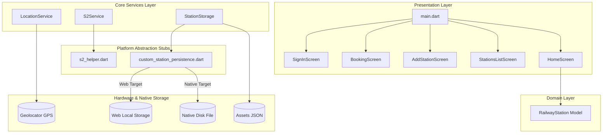

# Rail Two: Full System Architecture & Codebase Document

This document provides a comprehensive theoretical breakdown and code representation of the **Rail Two** application.

---

## 1. System Architecture Overview

The **Rail Two** application is built using a clean 4-tier layered architecture separating Presentation, Domain Models, Application Services, and Platform-Specific Hardware abstractions.



---

## 2. Core Codebase Implementation

### 2.1 App Entrypoint (`lib/main.dart`)
```dart
import 'package:flutter/material.dart';
import 'package:shared_preferences/shared_preferences.dart';
import 'screens/home_screen.dart';
import 'screens/signin_screen.dart';
import 'screens/login_screen.dart';

void main() async {
  WidgetsFlutterBinding.ensureInitialized();
  
  final prefs = await SharedPreferences.getInstance();
  final isRegistered = prefs.getBool('isRegistered') ?? false;
  final hasMpin = prefs.getString('mpin') != null;

  Widget initialScreen = const SignInScreen();
  if (isRegistered && hasMpin) {
    initialScreen = const LoginScreen();
  }

  runApp(RailwayFinderApp(initialScreen: initialScreen));
}

class RailwayFinderApp extends StatelessWidget {
  final Widget initialScreen;
  
  const RailwayFinderApp({super.key, required this.initialScreen});

  @override
  Widget build(BuildContext context) {
    return MaterialApp(
      title: 'Rail App',
      debugShowCheckedModeBanner: false,
      themeMode: ThemeMode.light,
      theme: ThemeData(
        brightness: Brightness.light,
        scaffoldBackgroundColor: const Color(0xFFF7F8FA),
        primaryColor: const Color(0xFF0066FF),
        colorScheme: const ColorScheme.light(
          primary: Color(0xFF0066FF),
          secondary: Color(0xFF1A2A4E),
        ),
        textTheme: const TextTheme(
          bodyLarge: TextStyle(color: Color(0xFF1E293B)),
          bodyMedium: TextStyle(color: Color(0xFF475569)),
        ),
        useMaterial3: true,
      ),
      home: initialScreen,
    );
  }
}
```

---

### 2.2 Domain Model (`lib/models/station.dart`)
```dart
import '../services/s2_helper.dart';

class RailwayStation {
  final String id;
  final String name;
  final double latitude;
  final double longitude;
  late final String s2CellToken;
  late final String s2CellId;

  RailwayStation({
    required this.id,
    required this.name,
    required this.latitude,
    required this.longitude,
  }) {
    _calculateS2Properties();
  }

  void _calculateS2Properties() {
    s2CellToken = s2Helper.getCellToken(latitude, longitude);
    s2CellId = s2Helper.getCellIdString(latitude, longitude);
  }

  factory RailwayStation.fromJson(Map<String, dynamic> json) {
    return RailwayStation(
      id: json['id'] as String,
      name: json['name'] as String,
      latitude: (json['latitude'] as num).toDouble(),
      longitude: (json['longitude'] as num).toDouble(),
    );
  }

  Map<String, dynamic> toJson() {
    return {
      'id': id,
      'name': name,
      'latitude': latitude,
      'longitude': longitude,
    };
  }

  RailwayStation copyWith({
    String? id,
    String? name,
    double? latitude,
    double? longitude,
  }) {
    return RailwayStation(
      id: id ?? this.id,
      name: name ?? this.name,
      latitude: latitude ?? this.latitude,
      longitude: longitude ?? this.longitude,
    );
  }
}
```

---

### 2.3 S2 Spatial Geometry Service (`lib/services/s2_service.dart`)
```dart
import 's2_helper.dart';

class S2Service {
  /// Converts latitude and longitude to an S2 cell token (hex representation).
  static String getCellToken(double lat, double lng) {
    return s2Helper.getCellToken(lat, lng);
  }

  /// Converts latitude and longitude to a 64-bit integer S2 cell ID.
  static String getCellIdString(double lat, double lng) {
    return s2Helper.getCellIdString(lat, lng);
  }

  /// Calculates the spherical distance in meters between two coordinates.
  static double calculateDistance(
    double lat1,
    double lng1,
    double lat2,
    double lng2,
  ) {
    return s2Helper.calculateDistance(lat1, lng1, lat2, lng2);
  }
}
```

---

### 2.4 GPS Hardware Location Service (`lib/services/location_service.dart`)
```dart
import 'package:geolocator/geolocator.dart';

class LocationService {
  static Future<bool> handleLocationPermission() async {
    bool serviceEnabled;
    LocationPermission permission;

    serviceEnabled = await Geolocator.isLocationServiceEnabled();
    if (!serviceEnabled) {
      return false;
    }

    permission = await Geolocator.checkPermission();
    if (permission == LocationPermission.denied) {
      permission = await Geolocator.requestPermission();
      if (permission == LocationPermission.denied) {
        return false;
      }
    }

    if (permission == LocationPermission.deniedForever) {
      return false;
    }

    return true;
  }

  static Future<Position?> getCurrentLocation() async {
    final hasPermission = await handleLocationPermission();
    if (!hasPermission) return null;

    try {
      return await Geolocator.getCurrentPosition(
        desiredAccuracy: LocationAccuracy.high,
      );
    } catch (e) {
      return null;
    }
  }

  static Stream<Position> getLocationStream() {
    return Geolocator.getPositionStream(
      locationSettings: const LocationSettings(
        accuracy: LocationAccuracy.high,
        distanceFilter: 10,
      ),
    );
  }
}
```

---

## 3. Spatial Mathematics & Haversine Equivalence

S2 spherical distance is derived from the angular distance $\theta$ between vectors $\mathbf{u}$ and $\mathbf{v}$ on a unit sphere:

$$\theta = 2 \cdot \arcsin\left(\frac{\|\mathbf{u} - \mathbf{v}\|}{2}\right)$$

Total distance $d$ in meters:

$$d = R_{\text{Earth}} \times \theta \quad \text{where } R_{\text{Earth}} \approx 6,371,000 \text{ m}$$
